# CareFlow Clinical Workspace · Enterprise Hospital EHR Operating System

[](https://nextjs.org/)
[](https://react.dev/)
[](https://www.typescriptlang.org/)
[](https://tailwindcss.com/)
[](https://abdm.gov.in/)
[](https://hl7.org/fhir/R4/)
[](https://meity.gov.in/)
[-brightgreen)]()

CareFlow is a mission-critical, enterprise-grade Clinical Intelligence, Triage Command, and Electronic Health Record (EHR) operating system. Built for tertiary hospitals, academic medical centers, and acute care networks, CareFlow bridges emergency resuscitation (Code STEMI), inpatient bed management, multi-coding diagnostics (ICD-10/11, SNOMED CT, LOINC), CPOE orders, and national digital health ecosystems (India ABDM Milestones M1, M2, M3 and HAPI FHIR R4).

---

## Table of Contents
1. [Executive Overview](#executive-overview)
2. [Clinical Design System & Stitch Tokens](#clinical-design-system--stitch-tokens)
3. [Master Screen Catalog & Architecture](#master-screen-catalog--architecture)
4. [Interoperability & Regulatory Standards](#interoperability--regulatory-standards)
5. [Folder & Module Documentation](#folder--module-documentation)
6. [Getting Started & Local Execution](#getting-started--local-execution)
7. [Testing, Linting & Build Verification](#testing-linting--build-verification)
8. [License](#license)

---

## Executive Overview

CareFlow was engineered to eliminate cognitive fragmentation in acute clinical environments. The platform centers around high-acuity longitudinal clinical encounters, exemplified by the index STEMI case of **Rahul Sharma (42M, Token #104, UHID DEL-2024-8841, ABHA 91-8842-1920-4491)** under Attending Interventional Cardiologist **Dr. Rohit Verma (MBBS, MD, DM Cardiology, MCI-2011-8921)**.

### Key Capabilities:
- **Triage & Emergency Resuscitation**: Sub-90-minute Door-to-Balloon cardiac telemetry integration, ESI acuity stratification, and real-time resuscitation bay allocation.
- **Longitudinal Delta Diff ("What Changed?")**: 3-column clinical comparison engine comparing baseline health records against acute encounters across vitals, symptoms, biomarkers, and medications.
- **Multimodal AI Copilot (`CareFlow AI`)**: CDSS Class IIb-validated clinical reasoning assistant grounded in 2024 ACC/AHA STEMI guidelines and patient EHR parameters with deterministic safety guards.
- **Inpatient Bed Board Command**: Real-time census engine orchestrating 420 licensed beds across CCU, HDU, and Med-Surg wards with telemetry waveforms, turnaround indicators, and emergency admissions.
- **Multi-Terminology Coding Engine**: Real-time disambiguation mapping diagnoses simultaneously across ICD-10, ICD-11, SNOMED CT, and AYUSH terminologies.
- **Printable Clinical Summary & ABHA Health Locker**: Dual screen/A4 print-optimized discharge summaries featuring hospital letterhead, discharge vitals, medication tables, verifiable ABDM QR token, and Class 3 DSC digital signing.
- **Enterprise Governance & Security**: 8-role x 16-permission interactive RBAC matrix, active endpoint session tracking with FIDO2 hardware token verification, and India DPDP Act 2023 compliance auditing.

---

## Clinical Design System & Stitch Tokens

The application is styled with Google Stitch design tokens mapped directly to clinical semantic utilities:

| Token Category | Token Variables | Clinical Semantic Purpose |
| :--- | :--- | :--- |
| **Surfaces** | `bg-surface`, `bg-surface-container`, `bg-surface-container-lowest` | Clean, glare-free background hierarchy for 24/7 ICU & cath lab monitors. |
| **Primary & Accents** | `bg-primary`, `text-on-primary`, `bg-primary-container` | Focused clinical highlights, active triage paths, and verified badges. |
| **Acuity & Alerts** | `bg-error`, `text-error`, `bg-error-container` | STAT P1 alerts, anaphylactic hard-stops (Penicillin), and elevated troponin flags. |
| **Warnings** | `bg-amber-500`, `text-amber-700` | Sub-optimally controlled conditions, borderline vitals, and DLT SMS warnings. |
| **Typography** | `font-body-default` (Inter), `font-clinical-data-mono` (JetBrains Mono) | Inter for clinician readability; JetBrains Mono for exact numerical lab values, drug doses, and timestamps. |
| **Print CSS Engine** | `print:hidden`, `print:pl-0`, `print:border-none`, `print:p-0` | Clean A4 output without navigation headers, sidebars, or layout clipping. |

---

## Master Screen Catalog & Architecture

The workspace encompasses **57 production routes** covering 100% of the 44 catalogued master screens:

### 1. Core Clinical Encounter Workspace
- [`/clinical-queue`](./src/app/clinical-queue/README.md) — Clinical Queue & Triage Command Center
- [`/triage-command`](./src/app/triage-command/README.md) — Emergency Triage & Code STEMI Protocol
- [`/patient-overview`](./src/app/patient-overview/README.md) — Longitudinal Patient Overview & Central Command
- [`/clinical-timeline`](./src/app/clinical-timeline/README.md) — Multi-Track Clinical Event Horizon
- [`/medical-history`](./src/app/medical-history/README.md) — Longitudinal Medical History Dossier
- [`/clinical-dossier`](./src/app/clinical-dossier/README.md) — Patient Lifelong Record & Health Binder
- [`/consultation-workspace`](./src/app/consultation-workspace/README.md) — OPD Consultation & Ambient AI Scribe
- [`/consultation-followup`](./src/app/consultation-followup/README.md) — Longitudinal Delta Diff ("What Changed?")
- [`/clinical-assistant`](./src/app/clinical-assistant/README.md) — CareFlow AI Clinical Copilot & Evidence Dock
- [`/clinical-summary`](./src/app/clinical-summary/README.md) — Encounter Clinical Summary
- [`/clinical-summary/print`](./src/app/clinical-summary/print/README.md) — Formal A4 Printable Discharge Summary (ABHA)
- [`/review-sign`](./src/app/review-sign/README.md) — Encounter Review & Digital Signature Attestation

### 2. Diagnostics, Investigations & Pathways
- [`/problems`](./src/app/problems/README.md) — Problems & Multi-Terminology Coding (ICD-10/11, SNOMED)
- [`/vitals-flowsheet`](./src/app/vitals-flowsheet/README.md) — Hemodynamic Vitals Flowsheet & MEWS Acuity
- [`/vitals-matrix`](./src/app/vitals-matrix/README.md) — High-Density Hemodynamic Telemetry Matrix
- [`/investigations`](./src/app/investigations/README.md) — Laboratory Investigations Hub
- [`/investigations/trajectory`](./src/app/investigations/trajectory/README.md) — Biomarker Longitudinal Trajectory (HbA1c / hs-cTnI)
- [`/assay-inspector`](./src/app/assay-inspector/README.md) — Laboratory Assay Inspector & Calibration Curves
- [`/imaging`](./src/app/imaging/README.md) — Radiology PACS Viewer & 12-Lead ECG Viewer
- [`/clinical-pathway`](./src/app/clinical-pathway/README.md) — STEMI Reperfusion Clinical Pathway Engine
- [`/clinical-rules-protocols`](./src/app/clinical-rules-protocols/README.md) — CDSS Rules & Institutional Protocols
- [`/red-flag-rule-builder`](./src/app/red-flag-rule-builder/README.md) — Visual No-Code Safety Rule Builder & Test Harness

### 3. Inpatient, Admissions & Operations
- [`/admissions-ipd`](./src/app/admissions-ipd/README.md) — Admissions & Inpatient Bed Board (420 Licensed Beds)
- [`/admissions-ipd/[id]`](./src/app/admissions-ipd/[id]/README.md) — Inpatient Clinical Encounter Chart & CCU Bedside
- [`/schedule-opd-slots`](./src/app/schedule-opd-slots/README.md) — OPD Capacity Roster & Clinician Scheduling
- [`/schedule-opd-slots/[id]`](./src/app/schedule-opd-slots/[id]/README.md) — Appointment Encounter Specifications
- [`/operations-command`](./src/app/operations-command/README.md) — Hospital Operations Command Center
- [`/discharge-referrals`](./src/app/discharge-referrals/README.md) — Discharge Pipeline & Inter-Facility Referrals
- [`/discharge-referrals/[id]`](./src/app/discharge-referrals/[id]/README.md) — Discharge Case File & Ambulance Handover

### 4. Orders, Medications & Pharmacy
- [`/cpoe`](./src/app/cpoe/README.md) — Computerized Physician Order Entry (CPOE)
- [`/orders`](./src/app/orders/README.md) — Centralized Diagnostic Orders Hub
- [`/clinical-orders`](./src/app/clinical-orders/README.md) — Clinical Orders & Specimen Scheduling
- [`/prescriptions`](./src/app/prescriptions/README.md) — e-Prescriptions Roster & Regimen Review
- [`/medication-reconciliation`](./src/app/medication-reconciliation/README.md) — Medication Reconciliation Hub
- [`/pharmacy-lab`](./src/app/pharmacy-lab/README.md) — In-House Pharmacy Dispensing & Lab Fulfillment
- [`/pharmacy-lab/prescriptions`](./src/app/pharmacy-lab/prescriptions/README.md) — Pharmacy Dispensing Queue
- [`/pharmacy-lab/reconciliation`](./src/app/pharmacy-lab/reconciliation/README.md) — Clinical Pharmacist Reconciliation
- [`/care-plan`](./src/app/care-plan/README.md) — Longitudinal Care Coordination Plan

### 5. Governance, Security, Interoperability & Administration
- [`/permission-matrix`](./src/app/permission-matrix/README.md) — Enterprise Roles & Permissions Matrix (RBAC/PAM)
- [`/access-active-sessions`](./src/app/access-active-sessions/README.md) — Active Sessions & Workstation Monitor
- [`/users-role-permissions`](./src/app/users-role-permissions/README.md) — User Directory & Access Control
- [`/users-role-permissions/[id]`](./src/app/users-role-permissions/[id]/README.md) — User Profile & Hardware Key Dossier
- [`/patient-registry`](./src/app/patient-registry/README.md) — Master Patient Index (MPI) & ABHA Registration
- [`/abdm-fhir-gateway`](./src/app/abdm-fhir-gateway/README.md) — ABDM & FHIR R4 Gateway Monitor
- [`/integration-logs`](./src/app/integration-logs/README.md) — Subsystem Bridges & Health Probes (8 Bridges)
- [`/security-privacy-center`](./src/app/security-privacy-center/README.md) — India DPDP Act 2023 & Compliance Center
- [`/quality-audit-logs`](./src/app/quality-audit-logs/README.md) — Forensic Audit Ledger & SHA-256 Chain
- [`/billing-payments`](./src/app/billing-payments/README.md) — Cashless TPA Settlement & Tariff Scheduling
- [`/document-tray`](./src/app/document-tray/README.md) — Clinical Document Tray & Scanned Records OCR

---

## Interoperability & Regulatory Standards

CareFlow is engineered for full compliance with national and international digital health standards:

```mermaid
graph TD
    A[CareFlow Clinical Workspace] --> B[Ayushman Bharat Digital Mission - ABDM]
    A --> C[HL7 FHIR R4 Engine]
    A --> D[Clinical Terminology Services]
    A --> E[India DPDP Act 2023 Security]

    B --> B1[Milestone M1: ABHA Creation & Verification]
    B --> B2[Milestone M2: HFR / HPR Registry Sync]
    B --> B3[Milestone M3: Electronic Consent & Data Exchange]

    C --> C1[Composition & DiagnosticReport Bundles]
    C --> C2[Encounter, CarePlan, Observation]
    C --> C3[MedicationRequest & Administration]

    D --> D1[ICD-10-CM / ICD-11 Multi-Coding]
    D --> D2[SNOMED CT International Core]
    D --> D3[LOINC Laboratory & Vitals Panels]
    D --> D4[NAMASTE AYUSH Terminology]

    E --> E1[AES-256 at Rest / FIPS 140-2 Level 3 CloudHSM]
    E --> E2[TLS 1.3 / mTLS Subsystem Bridges]
    E --> E3[Immutable SHA-256 Audit Trail]
    E --> E4[Automated PII Redaction Engine]
```



---

## Folder & Module Documentation

Every folder in this repository contains a dedicated `README.md` detailing its code structure and clinical significance:

- **Root & Shells**:
  - [`/public`](./public/README.md) — Static hospital branding, SVG badges, and icons.
  - [`/src`](./src/README.md) — Source code architecture.
  - [`/src/components`](./src/components/README.md) — Header, Sidebar, and SVG Icon design primitives.
  - [`/src/app`](./src/app/README.md) — Next.js App Router core, layout, and global styling.
- **Routes & Views**:
  - Refer to individual route subdirectories linked in the [Master Screen Catalog](#master-screen-catalog--architecture) above.

---

## Getting Started & Local Execution

### Prerequisites:
- **Node.js**: `v20.x` or `v22.x` (LTS recommended)
- **npm**: `v10.x` or higher

### 1. Installation:
Clone the repository and install dependencies:
```bash
git clone https://github.com/bhavyaku11/Hospital-Side-Panel.git
cd Hospital-Side-Panel
npm install
```

### 2. Running Locally (Development Mode):
Start the Turbopack development server:
```bash
npm run dev
```
Open your browser at [http://localhost:3000](http://localhost:3000).

---

## Testing, Linting & Build Verification

The codebase has undergone a zero-defect quality audit:

### 1. Run ESLint:
```bash
npm run lint
```
*Expected output: `✔ 0 errors, 0 warnings`*

### 2. Run Production Build:
```bash
npm run build
```
*Expected output: All 57 static and dynamic pages compile cleanly with 0 TypeScript errors.*

---

## License

Copyright © 2026 CareFlow Healthcare Technologies. All rights reserved.
Developed for medical center deployment under enterprise healthcare governance guidelines.
